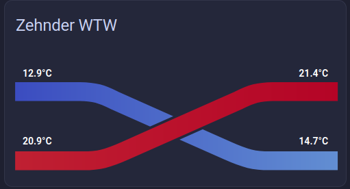

# 🌀 HRV Card


A custom Home Assistant Lovelace card for visualizing Heat Recovery Ventilation (HRV) systems with dynamic temperature flow gradients and a built-in UI editor.

## ✨ Features

* 🌡️ Real-time HRV temperature visualization
* 🎨 Dynamic color gradients (cold → warm flow mapping)
* 🧭 Dual airflow paths (outdoor → supply, extract → exhaust)
<!-- * 🧩 Built-in Lovelace UI editor (no YAML required) -->
* 🏠 Native Home Assistant card integration
* 📱 Responsive SVG-based visualization
* ⚡ Lightweight and fast (Lit-based)

## 📸 Preview


## 📦 Installation

### 🟡 HACS (recommended)

1. Open **HACS → Frontend**
2. Click **⋮ → Custom repositories**
3. Add this repository [https://github.com/CodedCactus/hrv-card](https://github.com/CodedCactus/hrv-card/)
4. Select category: **Lovelace**
5. Install **HRV Card**
6. Restart Home Assistant

### 🔧 Manual installation

1. Download `hrv-card.js` from the latest release
2. Copy it to:

   ```
   /config/www/hrv-card.js
   ```
3. Add the resource to Home Assistant:

    ```yaml
    resources:
      - url: /local/hrv-card.js
        type: module
    ```

4. Restart Home Assistant

## 🧩 Usage

### Add via UI

1. Go to your dashboard
2. Click **Add Card**
3. Select **HRV Card**

### Example configuration

```yaml
type: custom:hrv-card
title: HRV System
outdoor_temp: sensor.outdoor_temperature
supply_temp: sensor.hrv_supply_temperature
extract_temp: sensor.hrv_extract_temperature
exhaust_temp: sensor.hrv_exhaust_temperature
sensors:
  - entity: binary_sensor.hrv_bypass
    label: Bypass
  - entity: binary_sensor.hrv_pre_heater_status
    label: Heater
  - entity: sensor.hrv_exhaust_flow_rate
    label: Flow
  - entity: sensor.hrv_exhaust_fan_duty_cycle
    label: Duty
```


## ⚙️ Development

### Install dependencies

```bash
npm install
```

### Run development server

```bash
npm run dev
```

### Build for production / HACS

```bash
npm run build
```

Output:

```
dist/hrv-card.js
```

