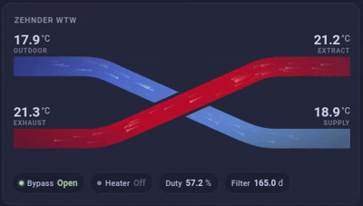

# 🌀 HRV Card


A custom Home Assistant Lovelace card for visualizing Heat Recovery Ventilation (HRV) systems with dynamic temperature flow gradients.

## ✨ Features

* 🌡️ **Real-time HRV temperature visualization** - Displays outdoor, supply, extract, and exhaust temperatures
* 🎨 **Dynamic color gradients** - Cold-to-warm flow mapping with smooth color transitions
* 🏠 **Native Home Assistant integration** - Seamless card integration with HA themes
* 📱 **Responsive SVG-based visualization** - Scales beautifully on all devices
* ⚡ **Lightweight and fast** - Built with Lit for optimal performance
* 🔧 **Customizable sensor display** - Show additional sensors with status indicators

## 📸 Preview



## 📦 Installation

### 🟡 HACS (Recommended)

1. Open **HACS → Frontend**
2. Click **⋮ → Custom repositories**
3. Add this repository: `https://github.com/CodedCactus/hrv-card`
4. Select category: **Lovelace**
5. Install **HRV Card**
6. Restart Home Assistant

### 🔧 Manual Installation

1. Download `hrv-card.js` from the [latest release](https://github.com/CodedCactus/hrv-card/releases)
2. Copy it to your Home Assistant's www directory:
   ```
   /config/www/hrv-card.js
   ```
3. Add the resource to your Home Assistant configuration:

   ```yaml
   resources:
     - url: /local/hrv-card.js
       type: module
   ```

4. Restart Home Assistant

## 🧩 Usage

### Add via UI Editor

1. Go to your dashboard in edit mode
2. Click **Add Card**
3. Search for and select **HRV Card**
4. Configure the required temperature sensors
5. Add optional sensors for additional status display

### YAML Configuration

```yaml
type: custom:hrv-card
title: HRV System
outdoor_temp: sensor.outdoor_temperature
supply_temp: sensor.hrv_supply_temperature
extract_temp: sensor.hrv_extract_temperature
exhaust_temp: sensor.hrv_exhaust_temperature
supply_flow: sensor.hrv_supply_flow
exhaust_flow: sensor.hrv_exhaust_flow
sensors:
  - entity: binary_sensor.hrv_bypass
    label: Bypass
  - entity: binary_sensor.hrv_pre_heater_status
    label: Heater
  - entity: sensor.hrv_exhaust_flow_rate
    label: Flow
    unit: m³/h
  - entity: sensor.hrv_exhaust_fan_duty_cycle
    label: Duty
    unit: "%"
```

## ⚙️ Configuration Options

| Option | Required | Type | Description |
|--------|----------|------|-------------|
| `title` | No | string | Card title (defaults to "HRV System") |
| `outdoor_temp` | Yes | string | Entity ID for outdoor temperature sensor |
| `supply_temp` | Yes | string | Entity ID for supply air temperature sensor |
| `extract_temp` | Yes | string | Entity ID for extract air temperature sensor |
| `exhaust_temp` | Yes | string | Entity ID for exhaust air temperature sensor |
| `supply_flow` | No | string | Entity ID for supply air flow sensor |
| `exhaust_flow` | No | string | Entity ID for exhaust air flow sensor |
| `sensors` | No | array | Array of additional sensors to display |

### Sensor Configuration

Each sensor in the `sensors` array supports:

| Option | Required | Type | Description |
|--------|----------|------|-------------|
| `entity` | Yes | string | Entity ID of the sensor |
| `label` | No | string | Display label (defaults to entity name) |
| `format` | No | string | Display format: `"binary"` or `"text"` (auto-detected) |
| `unit` | No | string | Unit to display (auto-detected from entity) |

## 🔧 Development

### Prerequisites

- Node.js (v16 or higher)
- npm or yarn

### Setup

```bash
# Clone the repository
git clone https://github.com/CodedCactus/hrv-card.git
cd hrv-card

# Install dependencies
npm install
```

### Development Commands

```bash
# Start development server
npm run dev

# Build for production
npm run build

# Build and watch for changes
npm run build:watch

# Preview production build
npm run preview

# Type checking
npm run typecheck
```

## 📄 License

This project is licensed under the MIT License - see the [LICENSE](LICENSE) file for details.
